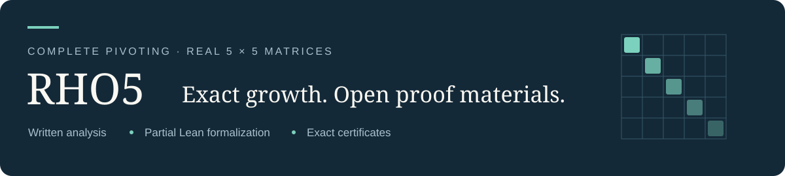

<p align="center"></p>

<p align="center">
  <a href="paper/rho5_manuscript.pdf"><b>Read the paper</b></a> ·
  <a href="paper/RHO5_SUPPLEMENTARY_INDEX.pdf"><b>Supplementary index</b></a> ·
  <a href="docs/VERIFY.md"><b>Verify the results</b></a> ·
  <a href="README.zh-CN.md"><b>中文</b></a>
</p>

# The exact maximum growth factor for complete pivoting on real 5 × 5 matrices

**Qianli Ma · Chao Wu**<br>
Zhejiang University · Qianli Ma also affiliated with WUJIE AI<br>
[qianli.ma@zju.edu.cn](mailto:qianli.ma@zju.edu.cn) · [chao.wu@zju.edu.cn](mailto:chao.wu@zju.edu.cn)

$$
\rho_5^{\mathbb R}=\alpha=4.132517078632472854223346853277\ldots.
$$

The algebraic candidate and attained lower bound are due to Chen, Edelman and Urschel. Our paper establishes the matching **global upper bound**, including every legal pivot tie and singular termination, through written analysis and exact computational certificates. The companion Lean development formalizes substantial analytic parts; its sharp equality retains two explicit global safety hypotheses.

**v1.0.1** — expanded 56-page article, 7-page supplementary index, and the completed first-phase Lean project cold-rebuild record. [Release and downloads](https://github.com/hkjtsgmc79-boop/rho5-proof/releases/tag/v1.0.1) · [What changed](CHANGELOG.md)

## Three ways into the proof

| Read the mathematics | Understand the evidence | Reproduce a result |
| :--- | :--- | :--- |
| **[Article · 56 pages](paper/rho5_manuscript.pdf)** | **[Supplementary index · 7 pages](paper/RHO5_SUPPLEMENTARY_INDEX.pdf)** | **[Step-by-step verification](docs/VERIFY.md)** |
| The theorem, global reductions, boundary cases, and an actual certificate example. | S1–S8 connect the proof to exact inputs, original sources and acceptance rules. | Begin with an 18.29 MB real certificate, then choose the larger components. |

## Proof architecture

1. **Fix the exact target.** Identify the algebraic constant and a real matrix attaining it.
2. **Cover every input.** Normalize legal elimination paths and account for pivot ties and degenerate boundaries.
3. **Control the remaining domains.** Combine analytic safety arguments with exact certificates for the X and B responsibilities.
4. **Compose the coverage.** Bind each accepted component to its actual source and combine the complete covers with the attained lower bound.

The [proof map](docs/PROOF_MAP.md) explains the role of each layer. Readers can follow the argument and the acceptance mechanism in the paper before running any program.

## Verification status

| Layer | Recorded result | Scope |
| :--- | :--- | :--- |
| Written proof + exact certificates | Complete real-field bound in the paper | Relies on the analytic arguments, exact acceptors and complete source/domain composition |
| Lean project cold rebuild | **634 product modules + 3 additional modules; 47 named axiom checks** | Explicit dependency-order driver; fixed third-party caches reused and supplemented |
| Final Lean equality | Conditional sharp endpoint | `XGlobalSafety` and `RootEndpointSafety` remain explicit |

See [the cold-rebuild record](docs/LEAN_COLD_REBUILD.md) for the successful route and retained evidence. The original packaged Lake cold-build command failed; the guide distinguishes it from the successful driver. A complete dependency-from-scratch build, a new all-components certificate replay, and a fully kernel-checked global theorem are separate responsibilities.

## Try one real certificate

From the repository root, list the available inputs or fetch the small example:

```sh
python3 scripts/fetch.py --list
python3 scripts/fetch.py --group sample
```

Continue with [the 54-leaf anchor walkthrough](docs/VERIFY.md#3-a-small-real-certificate). It checks a named part of the proof in approximately three minutes in the recorded X run; it does not rerun the original search or verify the entire domain. The downloader checks file identity; the subsequent verifier checks the mathematics.

**Download only what you need.** Lean source: **6.43 MB**. Small example: **18.29 MB**. Original archive collection: **4.494 GB**. [Sizes, disk space and measured timings](docs/DOWNLOADS.md).

The original 24 release assets remain immutable under **v1.0.0**. **v1.0.1** publishes the revised documents and indexes those exact same assets. The downloader retains their original URLs and SHA-256 identities, so existing downloads remain valid. GitHub’s automatic “Source code” ZIP does not include the large certificates.

<details>
<summary><b>Repository layout</b></summary>

| Directory | Contents |
| :--- | :--- |
| [`paper/`](paper/) | Current article, supplementary index, typesetting source and selected evidence |
| [`lean/`](lean/) | Frozen first-phase formalization and original build provenance |
| [`analytic/foundations/`](analytic/foundations/) | Exact constant, candidate and foundational source materials |
| [`verifiers/`](verifiers/) | Byte-identical verifier source mirrors; run with their original archive inputs |
| [`docs/`](docs/) | Verification guides, proof map, downloads and cold-rebuild scope |
| [`manifests/`](manifests/) | Original certificate identities and current release index |
| [`scripts/`](scripts/) | Downloader with resume, SHA-256 checks and multipart restoration |

</details>

## Cite and contact

Please cite the paper and identify the fixed release when using the materials; [CITATION.cff](CITATION.cff) provides machine-readable metadata. [GitHub v1.0.1](https://github.com/hkjtsgmc79-boop/rho5-proof/releases/tag/v1.0.1) is the current document release. Zenodo archival will follow; no DOI is claimed here. Existing third-party notices remain applicable.
