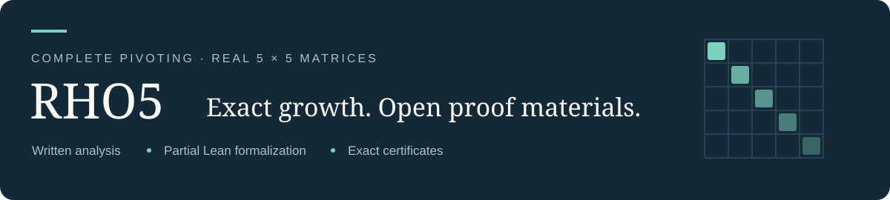

<p align="center"></p>

<p align="center"><a href="paper/rho5_manuscript.pdf"><b>阅读论文</b></a> · <a href="paper/RHO5_SUPPLEMENTARY_INDEX.pdf"><b>补充索引</b></a> · <a href="docs/VERIFY.zh-CN.md"><b>逐步验证</b></a> · <a href="README.md"><b>English</b></a></p>

# 实五阶完全主元消元的精确最大增长因子

**马千里 · 吴超**<br>
浙江大学；马千里另属 WUJIE AI<br>
[马千里](mailto:qianli.ma@zju.edu.cn) · [吴超](mailto:chao.wu@zju.edu.cn)

$$\rho_5^{\mathbb R}=\alpha=4.132517078632472854223346853277\ldots.$$

Chen、Edelman 与 Urschel 给出了代数候选常数和达到该值的下界。本文通过解析论证与精确计算证书证明匹配的**全局上界**，包括合法并列主元和奇异终止情形。配套 Lean 项目形式化了大量解析部分；最终尖锐等式仍明确保留两项全域安全前提。

**v1.0.2：** 88 页正文、9 页补充索引，以及 9 月 30 日负对角有限覆盖重新验收记录。新版论文已由 [Zenodo 归档，DOI 10.5281/zenodo.23057256](https://doi.org/10.5281/zenodo.23057256)。[发布页](https://github.com/hkjtsgmc79-boop/rho5-proof/releases/tag/v1.0.2) · [版本变化](CHANGELOG.md)

## 按你的目的开始

| 阅读数学 | 理解证据 | 动手复核 |
| :--- | :--- | :--- |
| **[论文 · 88 页](paper/rho5_manuscript.pdf)** | **[补充索引 · 9 页](paper/RHO5_SUPPLEMENTARY_INDEX.pdf)** | **[中文验证教程](docs/VERIFY.zh-CN.md)** |
| 全局归约、边界处理和真实证书示例 | S1–S8 对应证明责任、精确输入与验证入口 | 先运行小证书，再按需选择大组件 |

## 证明如何组合

精确常数与达到性 → 全部合法输入及边界的归约 → X/B 域的解析控制与精确证书 → 完整来源覆盖 → 匹配上下界。

[证明范围对应表](docs/PROOF_MAP.md)解释论文、Lean 和外部精确计算分别承担什么。论文提供足够的主线和接受规则，让读者在运行程序前审查论证。

## 已完成的复核与范围

| 层次 | 记录 | 范围 |
| :--- | :--- | :--- |
| 论文与精确证书 | 实数域完整上界及达到性 | 依赖解析论证、精确接受器和完整来源组合 |
| Lean 项目冷重建 | **634 个产品模块、3 个附加模块、47 项具名公理检查** | 显式依赖顺序构建；第三方缓存复用并补齐 |
| Lean 最终尖锐等式 | 条件性结论 | 保留 `XGlobalSafety`、`RootEndpointSafety` |
| 9 月 30 日负对角重放 | 570/570 项生产任务、原根重新验收与四父域回接 | 该有限覆盖 `effective_open_count = 0`；仍以前述解析和完整 X 结论为前提 |

冷重建的成功方式、原 Lake 命令失败情况和回执见[构建记录](docs/LEAN_COLD_REBUILD.md)。这个结果不是从零构建全部第三方依赖，也不是重新执行全部大证书，更不是完整无条件 Lean 闭合。

另附第二阶段 B366 的源码审阅快照：1,452 个已采纳 Lean 源码模块和四个有明确来源的支持模块。它不是独立冷构建包；快照之外还有 57 个直接导入依赖，两项全域安全前提也尚未由 Lean 消去。[证明与形式化范围](docs/PROOF_MAP.md)。

## 下载和运行

```sh
python3 scripts/fetch.py --list
python3 scripts/fetch.py --group sample
```

之后按[54 叶真实证书教程](docs/VERIFY.zh-CN.md#3-跑一个真实的-54-叶证书)运行数学检查。小例子约 **18.29 MB**，历史 X 运行约三分钟；Lean 源码约 **6.43 MB**，原始完整归档约 **4.494 GB**。[文件大小、磁盘与耗时说明](docs/DOWNLOADS.md)。

[v1.0.2 的五个新附件](docs/DOWNLOADS.md#new-v102-attachments)包括与 Zenodo 相同的 PDF、对应源码与小规模检查、重放证据和另行标注范围的二期 Lean 源码快照；[新版清单](manifests/v1.0.2.json)固定其大小和哈希。

**版本安排：** 新版论文、索引和本轮重放记录属于 `v1.0.2`；原来 24 个大型证书附件仍冻结在 `v1.0.0`。下载器核对哈希、续传并还原运输分片；下载成功本身不等于数学验证通过。GitHub 自动生成的源码 ZIP 不包含大证书附件。

引用信息见 [CITATION.cff](CITATION.cff)。新版预印本的具体 DOI 是 [10.5281/zenodo.23057256](https://doi.org/10.5281/zenodo.23057256)；[旧版 DOI](https://doi.org/10.5281/zenodo.22727368) 仍指 v1.0.1 的文件。
